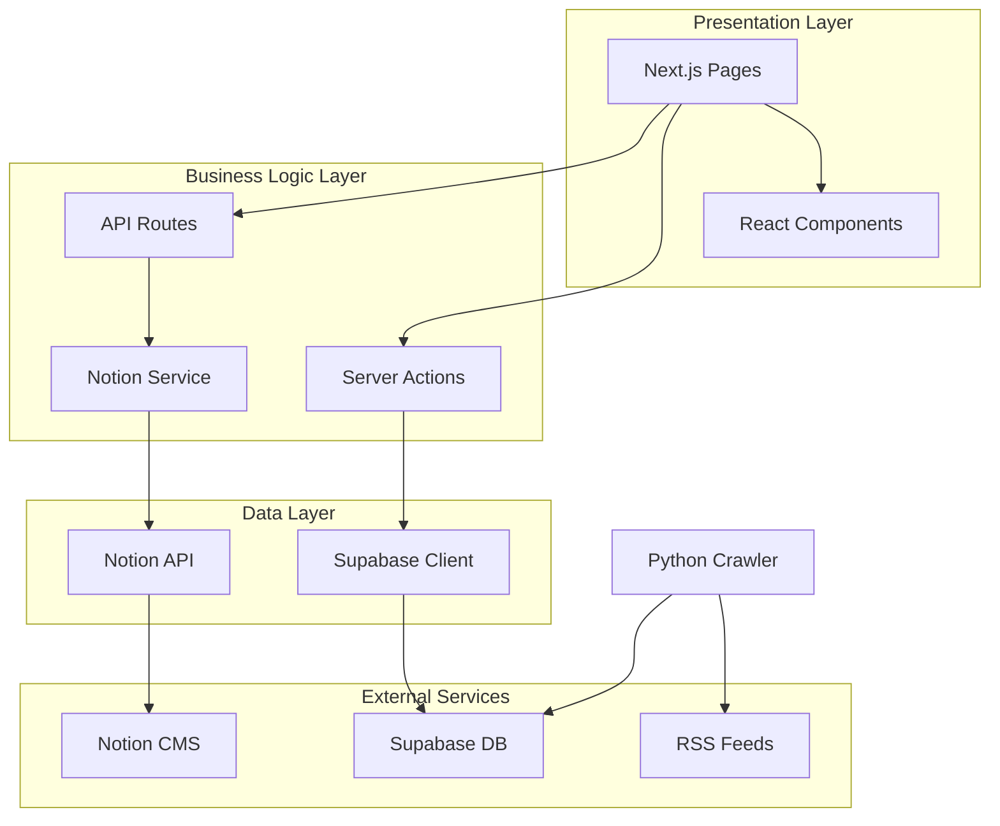
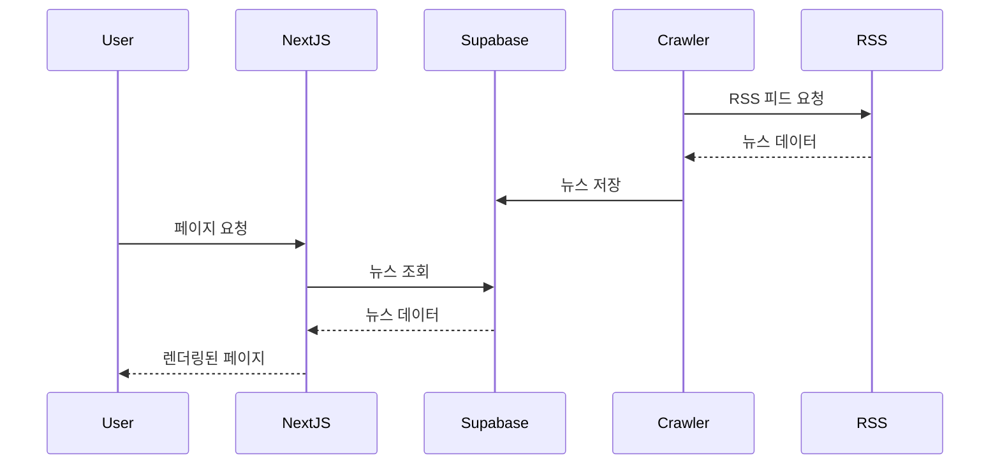
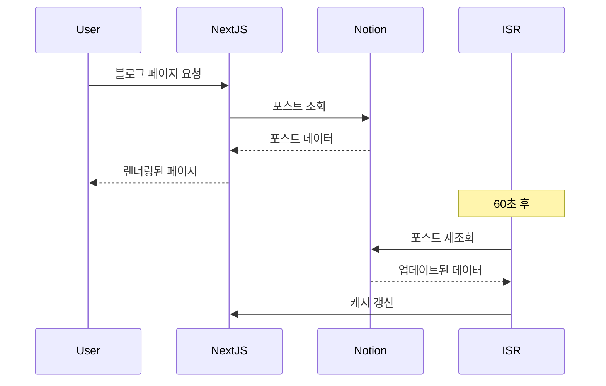

# 프로젝트 구조

이 문서는 게임 뉴스 애그리게이터의 폴더 구조와 아키텍처를 설명합니다.

## 폴더 구조

```
gameNews/
├── .github/                    # GitHub 설정
│   └── workflows/
│       └── manual_crawl.yml   # 크롤러 자동화 워크플로우
│
├── app/                        # Next.js App Router
│   ├── admin/                 # 관리자 페이지
│   ├── api/                   # API 라우트
│   │   └── blog/
│   │       └── create/        # 블로그 생성 API
│   ├── blog/                  # 블로그 페이지
│   │   ├── page.tsx          # 블로그 목록
│   │   └── [pageId]/         # 블로그 상세
│   │       └── page.tsx
│   ├── globals.css           # 전역 스타일
│   ├── layout.tsx            # 루트 레이아웃
│   └── page.tsx              # 홈 페이지 (뉴스 피드)
│
├── components/                # React 컴포넌트
│   ├── ui/                   # shadcn/ui 기본 컴포넌트
│   │   ├── avatar.tsx
│   │   ├── button.tsx
│   │   ├── card.tsx
│   │   └── separator.tsx
│   ├── markdown-renderer.tsx # Markdown 렌더러
│   ├── news-feed.tsx         # 뉴스 피드 컴포넌트
│   ├── post-card.tsx         # 포스트 카드
│   └── theme-provider.tsx    # 다크 모드 제공자
│
├── lib/                       # 유틸리티 및 서비스
│   ├── actions/              # Server Actions
│   │   └── blog.ts          # 블로그 관련 액션
│   ├── supabase/            # Supabase 클라이언트
│   │   ├── client.ts        # 클라이언트 사이드
│   │   └── server.ts        # 서버 사이드
│   ├── types/               # TypeScript 타입
│   │   └── database.ts      # 데이터베이스 타입
│   ├── notion.ts            # Notion API 서비스
│   └── utils.ts             # 유틸리티 함수
│
├── supabase/                 # Supabase 설정
│   ├── migrations/          # 데이터베이스 마이그레이션
│   └── schema.sql           # 데이터베이스 스키마
│
├── public/                   # 정적 파일
│   ├── images/              # 이미지 파일
│   └── favicon.ico          # 파비콘
│
├── docs/                     # 프로젝트 문서
│   ├── README.md            # 문서 인덱스
│   ├── overview.md          # 프로젝트 개요
│   ├── installation.md      # 설치 가이드
│   └── architecture.md      # 이 문서
│
├── crawler.py               # Python 뉴스 크롤러
├── requirements.txt         # Python 의존성
├── package.json            # Node.js 의존성
├── tsconfig.json           # TypeScript 설정
├── tailwind.config.ts      # Tailwind CSS 설정
├── next.config.ts          # Next.js 설정
└── .env.local              # 환경 변수 (Git 제외)
```

## 아키텍처 개요

### 레이어 구조



## 주요 컴포넌트 설명

### 1. App Router (`app/`)

Next.js 14의 App Router를 사용하여 파일 기반 라우팅을 구현합니다.

#### 페이지 구조

- **`page.tsx`**: 홈 페이지 (뉴스 피드)
- **`blog/page.tsx`**: 블로그 목록
- **`blog/[pageId]/page.tsx`**: 블로그 상세 (동적 라우트)
- **`admin/page.tsx`**: 관리자 페이지

#### API 라우트

- **`api/blog/create/route.ts`**: 블로그 포스트 생성 API

### 2. 컴포넌트 (`components/`)

재사용 가능한 React 컴포넌트들입니다.

#### UI 컴포넌트 (`ui/`)

shadcn/ui 기반의 기본 컴포넌트:

- **Avatar**: 사용자 아바타
- **Button**: 버튼 컴포넌트
- **Card**: 카드 레이아웃
- **Separator**: 구분선

#### 기능 컴포넌트

- **`news-feed.tsx`**: 뉴스 목록 표시
- **`post-card.tsx`**: 개별 뉴스 카드
- **`markdown-renderer.tsx`**: Markdown 렌더링

### 3. 라이브러리 (`lib/`)

비즈니스 로직과 유틸리티 함수들입니다.

#### Supabase 클라이언트

```typescript
// lib/supabase/client.ts - 클라이언트 컴포넌트용
// lib/supabase/server.ts - 서버 컴포넌트용
```

#### Notion 서비스

```typescript
// lib/notion.ts
- getPublishedPosts(): 게시된 포스트 목록
- getPageContent(): 페이지 콘텐츠 가져오기
- createPost(): 새 포스트 생성
```

#### 타입 정의

```typescript
// lib/types/database.ts
- Post: 뉴스 포스트 타입
- BlogPost: 블로그 포스트 타입
```

### 4. 크롤러 (`crawler.py`)

Python 기반 RSS 피드 크롤러입니다.

#### 주요 기능

- RSS 피드 파싱
- 카테고리 자동 분류
- 중복 확인
- Supabase 저장

#### 크롤링 소스

- Game Developer
- GamesIndustry.biz
- Polygon

## 데이터 플로우

### 뉴스 피드 플로우



### 블로그 플로우



## 렌더링 전략

### Static Site Generation (SSG)

- 블로그 목록 페이지
- 블로그 상세 페이지

### Incremental Static Regeneration (ISR)

- 60초마다 자동 재생성
- 새 포스트 자동 반영

### Server-Side Rendering (SSR)

- 뉴스 피드 (실시간 데이터)
- 관리자 페이지

## 상태 관리

### Server State

- Supabase 데이터: React Server Components
- Notion 데이터: ISR 캐싱

### Client State

- 다크 모드: Context API
- UI 상태: React useState

## 스타일링 전략

### Tailwind CSS

- 유틸리티 클래스 기반
- 커스텀 테마 설정
- 다크 모드 지원

### CSS 변수

```css
:root {
  --background: 0 0% 100%;
  --foreground: 222.2 84% 4.9%;
  /* ... */
}

.dark {
  --background: 222.2 84% 4.9%;
  --foreground: 210 40% 98%;
  /* ... */
}
```

## 보안 고려사항

### 환경 변수

- 클라이언트: `NEXT_PUBLIC_*` 접두사
- 서버: 일반 환경 변수

### API 키 보호

- `.env.local`은 Git 제외
- Vercel 환경 변수 사용

### RLS (Row Level Security)

- Supabase에서 데이터 접근 제어
- 읽기 전용 정책 적용

## 성능 최적화

### 이미지 최적화

- Next.js Image 컴포넌트 사용
- 자동 WebP 변환

### 코드 분할

- 동적 import 사용
- 라우트 기반 자동 분할

### 캐싱 전략

- ISR로 정적 페이지 캐싱
- Vercel Edge Network 활용

## 확장성 고려사항

### 모듈화

- 컴포넌트 재사용성
- 서비스 레이어 분리

### 타입 안정성

- TypeScript 엄격 모드
- 데이터베이스 타입 자동 생성

### 테스트 가능성

- 순수 함수 우선
- 의존성 주입 패턴
