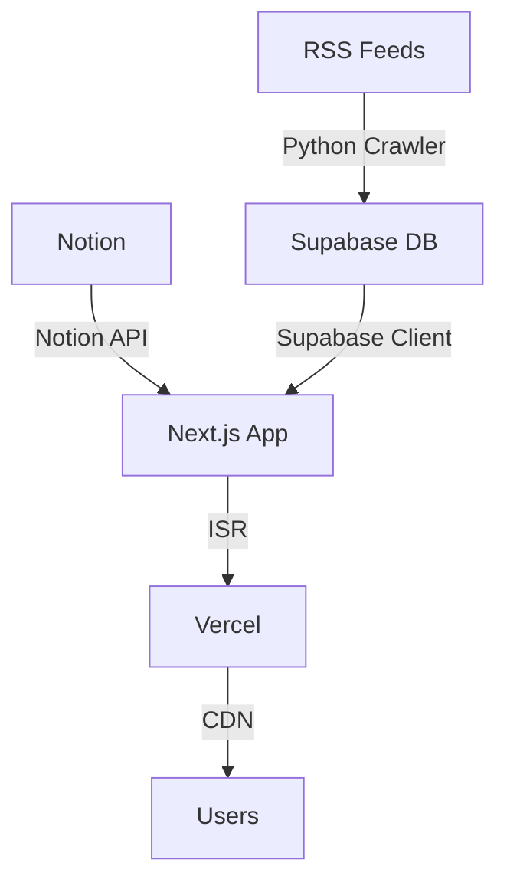

# 프로젝트 개요

## 소개

게임 뉴스 애그리게이터는 게임 업계 전문가를 위한 미니멀리스트 뉴스 피드 플랫폼입니다. 여러 게임 관련 뉴스 소스에서 자동으로 뉴스를 수집하고, Notion을 활용한 블로그 기능을 제공합니다.

## 주요 기능

### 🗞️ 뉴스 피드

- **자동 크롤링**: RSS 피드에서 자동으로 뉴스 수집
- **카테고리 분류**: Dev, Business, Tech, Release, Esports
- **최신순 정렬**: 가장 최근 뉴스를 먼저 표시
- **외부 링크**: 원본 기사로 바로 이동

### 📝 블로그 시스템

- **Notion CMS**: Notion을 헤드리스 CMS로 활용
- **Markdown 지원**: 풍부한 텍스트 포맷팅
- **ISR (Incremental Static Regeneration)**: 60초마다 자동 업데이트
- **반응형 디자인**: 모바일, 태블릿, 데스크톱 지원

### 🎨 UI/UX

- **다크 모드**: 눈의 피로를 줄이는 다크 테마
- **반응형 레이아웃**: 모든 디바이스에서 최적화된 경험
- **미니멀 디자인**: 콘텐츠에 집중할 수 있는 깔끔한 인터페이스

### 🤖 자동화

- **GitHub Actions**: 자동 크롤링 워크플로우
- **수동 트리거**: 필요시 즉시 크롤링 실행
- **중복 방지**: 이미 수집된 뉴스는 자동으로 건너뛰기

## 기술 스택

### Frontend

- **Next.js 16**: React 기반 풀스택 프레임워크
- **TypeScript**: 타입 안정성 보장
- **Tailwind CSS**: 유틸리티 기반 CSS 프레임워크
- **shadcn/ui**: 재사용 가능한 UI 컴포넌트

### Backend & Database

- **Supabase**: PostgreSQL 데이터베이스 및 인증
- **Notion API**: 블로그 콘텐츠 관리
- **Python**: 뉴스 크롤러 스크립트

### Deployment & CI/CD

- **Vercel**: 프론트엔드 호스팅
- **GitHub Actions**: 자동화된 크롤링

## 아키텍처

### 데이터 플로우

1. **뉴스 수집**
   - Python 크롤러가 RSS 피드에서 뉴스 수집
   - 카테고리 자동 분류 및 중복 확인
   - Supabase 데이터베이스에 저장

2. **블로그 콘텐츠**
   - Notion에서 블로그 포스트 작성
   - Notion API를 통해 콘텐츠 가져오기
   - ISR을 통해 60초마다 자동 업데이트

3. **사용자 경험**
   - Next.js App Router로 빠른 페이지 전환
   - Vercel CDN을 통한 전세계 빠른 로딩
   - 반응형 디자인으로 모든 기기 지원

## 프로젝트 목표

### 단기 목표

- ✅ 뉴스 피드 자동 수집
- ✅ Notion 블로그 통합
- ✅ 다크 모드 지원
- ✅ 반응형 디자인

### 중기 목표

- [ ] 검색 및 필터링 기능
- [ ] 사용자 인증 및 북마크
- [ ] 실시간 업데이트 (Supabase Realtime)
- [ ] 페이지네이션

### 장기 목표

- [ ] AI 기반 뉴스 요약
- [ ] 개인화된 뉴스 추천
- [ ] 모바일 앱 (React Native)
- [ ] 다국어 지원

## 대상 사용자

- **게임 개발자**: 최신 개발 도구 및 기술 동향
- **게임 비즈니스 전문가**: 산업 트렌드 및 시장 분석
- **게임 저널리스트**: 뉴스 소스 및 정보 수집
- **게임 애호가**: 게임 출시 및 e스포츠 소식

## 라이선스

MIT License - 자유롭게 사용, 수정, 배포 가능
